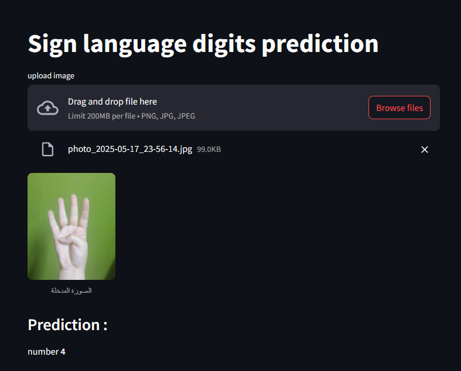

# ☝️ Sign-language-digits-prediction
### " Using convolutional neural network (CNN) "


This project implements a convolutional neural network (CNN) to classify handwritten Arabic digits using TensorFlow and Keras. It includes both training code and a Streamlit web interface for making predictions on new images.





## Project Overview

This application recognizes handwritten Arabic numerals (0-9) using a custom trained CNN. The model handles the unique mapping between Arabic numerals and their class indices, allowing accurate classification of uploaded handwritten digits.

## Dataset

The model was trained on a dataset of 64x64 grayscale images of handwritten Arabic digits. The dataset uses a special mapping between indices and actual digit values:

| Index | Actual Digit |
|-------|-------------|
| 0     | 9           |
| 1     | 0           |
| 2     | 7           |
| 3     | 6           |
| 4     | 1           |
| 5     | 8           |
| 6     | 4           |
| 7     | 3           |
| 8     | 2           |
| 9     | 5           |

## Model Architecture

The model uses a convolutional neural network with the following architecture:
- 3 convolutional layers with ReLU activation and max pooling
- Fully connected layer with 128 neurons 
- Dropout layer (0.5) to prevent overfitting
- Output layer with 10 neurons (softmax activation)

## Model Accuracy
- accuracy: 0.9318 
- loss: 0.2119

## Project Structure

```
├── dataset/
│   ├── x.npy          # Image data
│   └── y.npy          # One-hot encoded labels
├── model.h5           # Saved trained model
├── train_model.py     # Model training script
├── app.py             # Streamlit web interface
├── requirements.txt   # Project dependencies
└── README.md          # This file
```

## Installation

1. Clone this repository:
   ```
   git clone <repository-url>
   cd sign-language-digits
   ```

2. Create a virtual environment (optional but recommended):
   ```
   python -m venv venv
   source venv/bin/activate  # On Windows: venv\Scripts\activate
   ```

3. Install the required dependencies:
   ```
   pip install -r requirements.txt
   ```

## Usage

### Training the Model

The model has already been trained and saved as `model.h5`. If you want to retrain it:

```
python train_model.py
```

### Running the Streamlit Web Interface

To start the web interface for making predictions:

```
streamlit run app.py
```

This will open a browser window with the Streamlit interface where you can:
1. Upload an image of a handwritten Arabic digit
2. View the preprocessed image
3. Get the model's prediction

## Web Interface Features

- **Image Upload**: Upload images of handwritten Arabic digits
- **Image Preprocessing**: Automatically resizes and preprocesses uploaded images
- **Prediction Display**: Shows the model's prediction along with confidence score
- **Simple and Intuitive UI**: Easy to use interface for quick predictions

## Dependencies

- TensorFlow 2.x
- NumPy
- Matplotlib
- scikit-learn
- Streamlit


## Implementation of the Streamlit App

The Streamlit app (`app.py`) provides an intuitive interface where users can:
1. Upload an image file containing a handwritten digit
2. The app preprocesses the image to match the training data format (64x64 grayscale)
3. The app runs the image through the model and displays the prediction
4. The mapping is applied to convert from model output to actual digit value

## Future Improvements

- Add batch prediction capability
- Implement confidence threshold filtering
- Add drawing capability to create digits directly in the interface
- Improve model accuracy with data augmentation
- Add support for recognizing multiple digits in a single image


